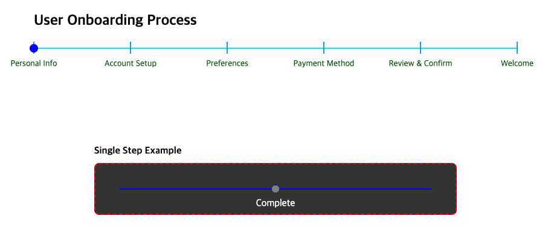

# React Step Slider

`react-step-slider` is a step-based slider component that allows users to navigate through steps with customizable styling and full accessibility support.



## Requirements

- **React**: ^18.0.0 or higher
- **Node.js**: ^16.0.0 or higher (for development)
- **TypeScript**: Optional but recommended for better development experience

## Installation

Install the package using npm or yarn

```bash
npm install react-step-slider

yarn add react-step-slider
```

## Usage

```typescript
import { ReactStepSlider } from "react-step-slider";

function App() {
  const handleStepChange = (value: number) => {
    console.log("Current step:", value);
  };

  return (
    <ReactStepSlider
      steps={8}
      onChange={handleStepChange}
      dotColor="red"
      dotSize={12}
      verticalLineColor="green"
      verticalLineHeight={25}
      verticalLineWidth={3}
      horizontalLineHeight={3}
      horizontalLineColor="lightblue"
      labels={[
        "first label",
        "second label hello world",
        "third label",
        "fourth label",
        "fifth label",
      ]}
      labelSize={16}
      labelColor="#333333"
      ellipsisLabelWidth={110}
      initialIndex={0}
      pointerBoundary={8}
      transitionDuration={0.5}
      className="custom-slider"
      style={{ border: "1px solid #ccc", padding: "10px" }}
      aria-label="Navigation steps"
    />
  );
}

export default App;
```

## Props

| Prop                 | Type                     | Required | Default      | Description                                          |
| -------------------- | ------------------------ | -------- | ------------ | ---------------------------------------------------- |
| onChange             | (value: number) => void  | ✅       | -            | Callback function triggered on step change          |
| steps                | number                   | ✅       | -            | Number of steps in the slider                        |
| dotColor             | string                   | ❌       | #0000ff      | Color of the moving dot (hex or CSS color names)     |
| dotSize              | number                   | ❌       | 12           | Size of the moving dot in pixels                     |
| verticalLineColor    | string                   | ❌       | #0000ff      | Color of the vertical lines (hex or CSS color names) |
| verticalLineHeight   | number                   | ❌       | 16           | Height of the vertical lines in pixels               |
| verticalLineWidth    | number                   | ❌       | 2            | Width of the vertical lines in pixels                |
| horizontalLineColor  | string                   | ❌       | #0000ff      | Color of the horizontal line (hex or CSS color names)|
| horizontalLineHeight | number                   | ❌       | 2            | Height of the horizontal line in pixels              |
| labels               | Array<string>            | ❌       | []           | Array of labels for each step                        |
| labelSize            | number                   | ❌       | 16           | Font size of label text in pixels                    |
| labelColor           | string                   | ❌       | #000000      | Color for label text (hex or CSS color names)        |
| ellipsisLabelWidth   | number                   | ❌       | 20           | Width of label container in pixels                   |
| initialIndex         | number                   | ❌       | 0            | Initial step index (0-based)                         |
| pointerBoundary      | number                   | ❌       | 8            | Padding around clickable area in pixels              |
| transitionDuration   | number                   | ❌       | 0.3          | Animation duration for dot transition in seconds     |
| className            | string                   | ❌       | ""           | Additional CSS class names                           |
| style                | CSSProperties            | ❌       | undefined    | Inline styles for the container                      |
| aria-label           | string                   | ❌       | "Step slider"| Accessible label for screen readers                 |

## Features

- ✅ **Accessible**: Full keyboard navigation support with proper ARIA attributes
- ✅ **Customizable**: Extensive styling options for colors, sizes, and layout
- ✅ **Flexible Colors**: Support for hex colors (#ff0000) and CSS color names (red, blue, etc.)
- ✅ **Animation Control**: Adjustable transition duration for dot movement
- ✅ **Flexible Styling**: Support for both CSS classes and inline styles
- ✅ **Typescript**: Full Typescript support with proper type definitions
- ✅ **Responsive**: Works well on different screen sizes
- ✅ **Lightweight**: Minimal dependencies and optimized performance
- ✅ **Testing**: Comprehensive test coverage with Jest and React Testing Library

## Technical Highlights

### Performance Optimization

- **Memoized Calculations**: Uses `useMemo` and `useCallback` to prevent unnecessary re-renders
- **Efficient Style Computation**: Inline styles are computed once and cached
- **Minimal Re-renders**: Dependency arrays are carefully optimized
- **Zero External Dependencies**: No CSS files or external libraries required

### Type Safety & Validation

- **Strict TypeScript**: Comprehensive type definitions with HexColor validation
- **Runtime Validation**: Props validation with descriptive error messages
- **Edge Case Handling**: Division-by-zero protection and boundary checks
- **Developer Experience**: Clear error messages and console warnings

### Architecture Patterns

- **Separation of Concerns**: Business logic separated from presentation
- **Controlled Component**: External state management via onChange callback
- **Accessibility First**: WCAG-compliant with proper semantic markup
- **Progressive Enhancement**: Keyboard navigation with arrow key support

## Accessibility Features

- **Keyboard Navigation**: Navigate using Tab, Enter, and Space keys
- **Screen Reader Support**: Proper ARIA labels and descriptions
- **Focus Management**: Clear focus indicators and logical tab order
- **Semantic HTML**: Uses proper button and slider roles

## Advanced Examples

### Basic Usage

```typescript
import { ReactStepSlider } from "react-step-slider";

function BasicExample() {
  const [currentStep, setCurrentStep] = useState(0);

  return (
    <ReactStepSlider
      steps={5}
      onChange={setCurrentStep}
      initialIndex={currentStep}
    />
  );
}
```

### Custom Styling

```typescript
function CustomStyledExample() {
  const [step, setStep] = useState(0);

  return (
    <ReactStepSlider
      steps={7}
      onChange={setStep}
      dotColor="#ff4444"
      dotSize={16}
      verticalLineColor="#333"
      verticalLineHeight={20}
      verticalLineWidth={3}
      horizontalLineColor="#ddd"
      horizontalLineHeight={4}
      labelSize={14}
      labelColor="#555555"
      ellipsisLabelWidth={120}
      pointerBoundary={12}
      transitionDuration={0.8}
      className="my-custom-slider"
      labels={[
        "Start",
        "Profile Setup",
        "Preferences",
        "Payment",
        "Confirmation",
        "Complete",
        "Finish"
      ]}
    />
  );
}
```

### With Labels and Accessibility

```typescript
function AccessibleExample() {
  const [step, setStep] = useState(0);
  const steps = ["Personal Info", "Address", "Payment", "Review", "Complete"];

  return (
    <div>
      <h2>Registration Process</h2>
      <ReactStepSlider
        steps={steps.length}
        onChange={setStep}
        initialIndex={step}
        labels={steps}
        labelSize={12}
        ellipsisLabelWidth={100}
        aria-label="Registration progress"
      />
      <p>Current step: {steps[step]}</p>
    </div>
  );
}
```

### Color Formats

```typescript
function ColorExample() {
  const [step, setStep] = useState(0);

  return (
    <div>
      {/* Hex colors */}
      <ReactStepSlider
        steps={3}
        onChange={setStep}
        dotColor="#ff6b35"
        verticalLineColor="#4ecdc4"
        horizontalLineColor="#45b7d1"
        labelColor="#2c3e50"
        labels={["Hex", "Colors", "Example"]}
      />

      {/* CSS color names */}
      <ReactStepSlider
        steps={3}
        onChange={setStep}
        dotColor="crimson"
        verticalLineColor="seagreen"
        horizontalLineColor="steelblue"
        labelColor="darkslategray"
        labels={["CSS", "Color", "Names"]}
      />

      {/* Mixed formats */}
      <ReactStepSlider
        steps={3}
        onChange={setStep}
        dotColor="gold"
        verticalLineColor="#8e44ad"
        horizontalLineColor="lightgray"
        labelColor="navy"
        labels={["Mixed", "Formats", "Work"]}
      />
    </div>
  );
}
```

### Animation and Styling Control

```typescript
function AnimationExample() {
  const [step, setStep] = useState(0);

  return (
    <div>
      {/* Slow, smooth animation */}
      <ReactStepSlider
        steps={4}
        onChange={setStep}
        transitionDuration={1.2}
        dotColor="mediumseagreen"
        labelColor="darkgreen"
        style={{ 
          backgroundColor: "#f5f5f5", 
          padding: "20px", 
          borderRadius: "8px",
          marginBottom: "20px"
        }}
        className="shadow-lg"
        labels={["Slow", "Smooth", "Animation", "Demo"]}
      />

      {/* Fast, snappy animation */}
      <ReactStepSlider
        steps={4}
        onChange={setStep}
        transitionDuration={0.1}
        dotColor="orangered"
        labelColor="white"
        style={{ 
          border: "2px dashed orangered",
          backgroundColor: "#424242",
          padding: "15px" 
        }}
        labels={["Fast", "Snappy", "Quick", "Done"]}
      />
    </div>
  );
}
```

## Development

To run the project locally:

```bash
# Install dependencies
npm install

# Run development server
npm run dev

# Run tests
npm test

# Run tests with coverage
npm run test:coverage

# Build the library
npm run build-tsup

# Lint code
npm run lint
```

## License

MIT © crayonzgrim
